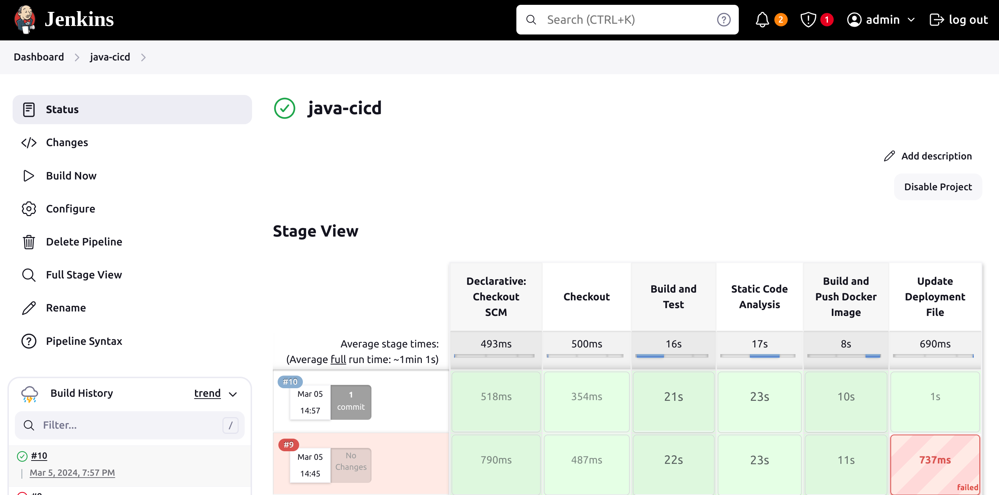
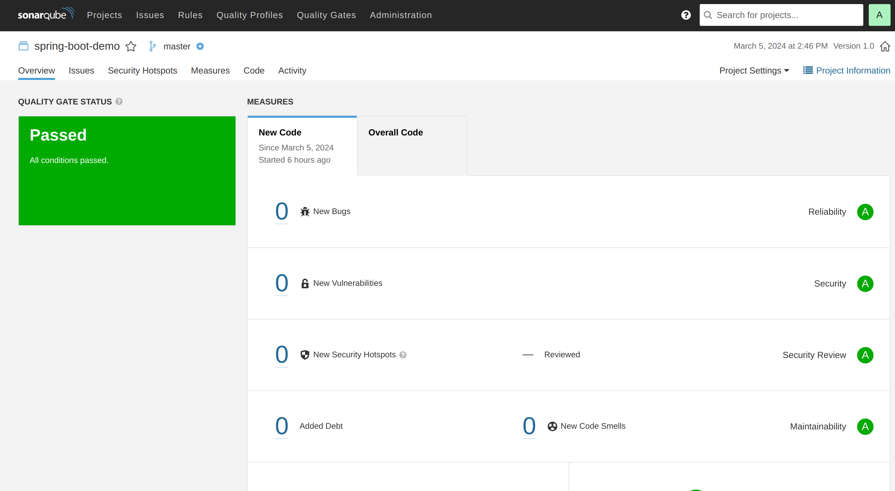
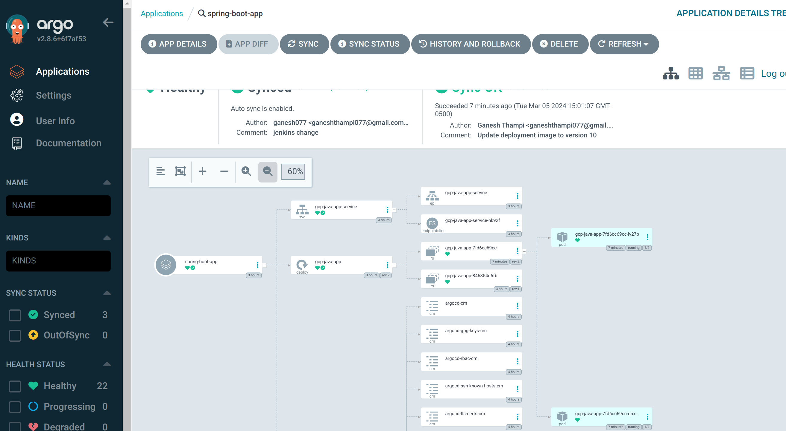
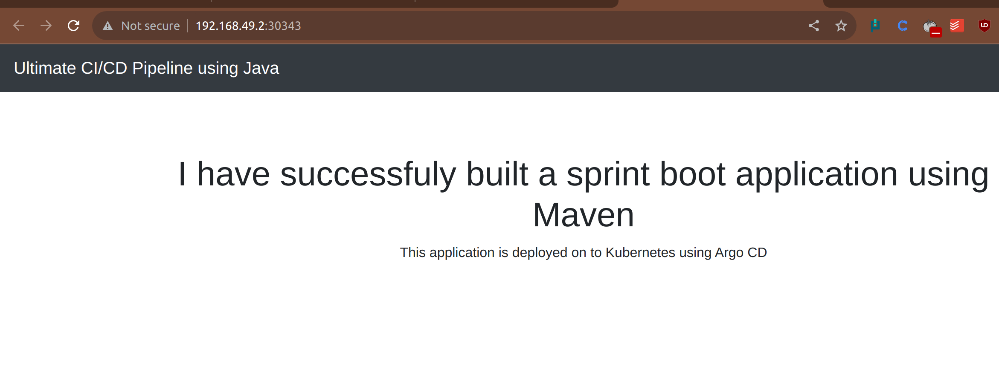

# Setting up an End-to-End Jenkins Pipeline for a Java Application with SonarQube, Argo CD, and Kubernetes

## Prerequisites:
- Provision a GCP VM and install Jenkins server and setup sonarqube in it.
- Kubernetes cluster(Minikube)
- Sonarqube
- Argo CD

## Steps:

1. **Install Necessary Jenkins Plugins:**
   1. Git plugin
   2. Sonarqube plugin
   3. Pipeline plugin
   4. Kubernetes Continuous Deploy plugin

2. **Create a New Jenkins Pipeline:**
   - Create a new pipeline job in Jenkins and configure it with the Git repository URL for the Java application.
   - Add a Jenkinsfile to the Git repository to define the pipeline stages.

3. **Define Pipeline Stages:**
   - **Stage 1:** Clone source code from Git.
   - **Stage 2:** Build a Java application using Maven (or a docker image with Maven base).
   - **Stage 3:** Run unit tests using JUnit and Mockito.
   - **Stage 4:** Run SonarQube analysis to check code quality.
   - **Stage 5:** Package application into a JAR file.
   - **Stage 6:** Dockerize the application and push it to the docker hub. Update the manifest files.
   - **Stage 7:** Promote application to production environment using Argo CD.
  

4. **Configure Jenkins Pipeline Stages:**
   - Detailed configuration steps outlined for each stage.

5. **Set up Argo CD:**
   - Install Argo CD on the Kubernetes cluster.
   - Set up Git repository for Argo CD to track changes in Kubernetes manifests.
   - Deploy to Kubernetes cluster when changes are detected.
  

6. **Configure Jenkins Pipeline to Integrate with Argo CD:**
   - Add Argo CD API token to Jenkins credentials.
   - Update Jenkins pipeline to include Argo CD deployment stage.

7. **Run the Jenkins Pipeline:**
   - Trigger Jenkins pipeline to start CI/CD process for Java application.
   - Monitor pipeline stages and fix any issues that arise.
  

This end-to-end Jenkins pipeline automates a Java application's entire CI/CD process, from code checkout to production deployment, utilizing popular tools like SonarQube, Argo CD, and Kubernetes.
